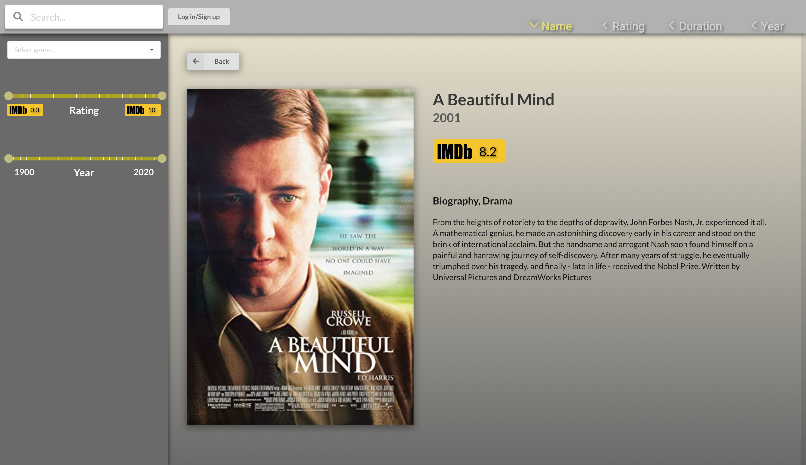

# IT2810 - Team 55 -  Prosjekt 3
Dette prosjektet er en filmdatabase laget ved hjelp av Node.js, React, Typescript, Redux for global state håndtering, MongoDB for databasen, Rest API for innhenting av data og Material UI og Semeatic UI for noen komponenter. Se Beskrivelse for utvidet infromasjon. 

## Beskrivelse
### Funksjonalitet og teknologi
Løsningen er laget i React, og initialisert med create-react-app, med typescript som template. Løsningen er en filmdatabase, for å dekke kravene til oppgaven har vi følgende funksjonaliteter:
* Søkemulighet ved hjelp av input felt.
* Filtrerinsgmuligheter ved hjelp av slider for rangering og årstall, samt sjangervalg.
* Sortering av utvalget etter navn, rangering, filmens varighet eller årstall, sant mulighet for å invertere resultatet.
* Paginering slik at filmene presenteres i et sett.
* Popup for å gi en mer detaljert beskrivelse av filmen.
* Lagring av brukerdata ved hjelp av brukerlogging, og lagring/sletting av filmer til en "Movie list" unik for brukeren.
* Database på virtuell maskin for å håndtere filmdata og brukerdata.

Under utviklingen har vi brukt Redux for å håndtere states.

For å håndtere databasen vår ble det brukt MongoDB.

Vi har satt opp applikasjonen vår til å kjøre en REST server lokalt ved hjelp av Express, og Node. REST serveren er skrevet i TypeScript og kjører ved hjelp av ts-node pakken.

Det er lagt opp til at vurdering av prosjektet gjøres lokalt ved å klone repoet. Følg kommandoer under for hvordan du kan kjøre prosjektet på egen maskin. 

## Kommandoer
### For å kjøre lokalt:
* Klon repoet fra GitLab 
`git clone https://gitlab.stud.idi.ntnu.no/it2810-h20/team-55/prosjekt-3.git`
* Sjekk at du er koblet til [VPN](https://innsida.ntnu.no/wiki/-/wiki/Norsk/Installere+VPN) eller [NTNU sitt nettverk](https://innsida.ntnu.no/wiki/-/wiki/Norsk/Trådløst+nett). Du vil måtte gjøre dette for å kunne hente data fra databasen, som ligger på VM hos NTNU. 
* Første gang du kjører (eller ved package.json endringer): `npm run firstStart` i rotmappen.
* Installasjon kan muligens ta en liten stund, varierende fra maskin og nettverk
* Hvis det er problemer med npm pakker, kjør `npm run setup` i rotmappen.
* Hvis det fortsatt er problemer med å starte/kjøre tester, kjør `npm install` separat i både backend og frontend mappene.
* Ellers: `npm start` i rotmappen.

### For å bare kjøre backend:
* Sjekk at du er på VPN/ NTNU nett
* Kjøre første gang: `cd backend` => `npm install` => `npm start`
* Ellers: `cd backend` => `npm start`

### For å bare kjøre frontend:
* Sjekk at du er på VPN/ NTNU nett
* Kjøre første gang: `cd frontend` => `npm install` => `npm start`
* ellers: `cd frontend` => `npm start`

### For å kjøre tester:
* For enhetstester:  `cd frontend` => `npm test`
* For ende-til-ende tester: `cd frontend` => `npx cypress open`
    (For å kjøre ende-til-ende testene må både frontend og backend allerede kjøre, og `npm run firstStart` eller `npm run setup` må ha blitt kjørt i rotmappen)

### Testing 
Vi har brukt både Jest, og Cypress for å ha enhetstester, og ende-til-ende tester. Referer til [Kommandoer](#Kommandoer) for å kjøre dem. Jest er brukt for Snapshot tester, som sjekker at riktig antall komponenter blir rendret, og at props blir passet korrekt. 
Cypress er brukt for å automatisere testene, vi har laget simulasjonene med tanke på hvordan en bruker ville brukt applikasjonen vår. Simulasjonene dekker også alle kravene til funksjonalitene. I tillegg har vi gjort API test calls gjennom Cypress. Crypress kan ta en stund å laste ned.

Etter å ha kjørt `npx cypress open` i frontend vil du muligens bli spurt om å tillate tilgang for cypress, noe som er nødvendig. Deretter vil det være en popup som viser deg alle testene. Brukere kan fritt velge fra listen og kjøre de hver for seg. Her er det viktig å la testene kjøre ferdig. Trykk på navnet på test fila, IKKE "Open in IDE".

* APItestCall: Simulerer get/post request og sjekker dette opp mot databasen
* simulation1: Simulerer en bruker som ønsker å legge filmer til watched list
* simulation2: Simulerer en bruker som ønsker å søke lese detaljer på den eldste filmen med rating 7 eller høyere
* simulation3: Simulerer en bruke på mobil som ønsker å søke opp den korteste filmen mellom 1990 og 2005

### Ressurser
- Innholdet fra databasen er tatt fra [FEND16](https://github.com/FEND16/movie-json-data?fbclid=IwAR1x59Rv0NctGe8NrlnWahhZGjgEwLFy0ZiUm_mX6ghofQVg_FJUfim-QHM).
- For tredjeparts komponenter har vi brukt [Semantic UI](https://react.semantic-ui.com/) og [Material-UI](https://material-ui.com).
- I tillegg til Jest, har vi brukt [@testing-libray/user-event](https://github.com/testing-library/user-event) og [Cypress](https://www.cypress.io/).

This project was bootstrapped with [Create React App](https://github.com/facebook/create-react-app).
